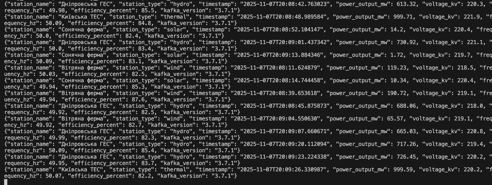

# Лабораторна робота №1

#Практична робота Kafka

# Тема:

Основи роботи з Apache Kafka у розподілених базах даних

# Мета:

Ознайомитися з архітектурою Apache Kafka та її роллю в обробці потокових даних.
Навчитися створювати топіки, продюсерів і конс’юмерів.
Відпрацювати передачу повідомлень у розподіленому середовищі.

Producer logs:

Console logs after producer work:

Consumer logs:

