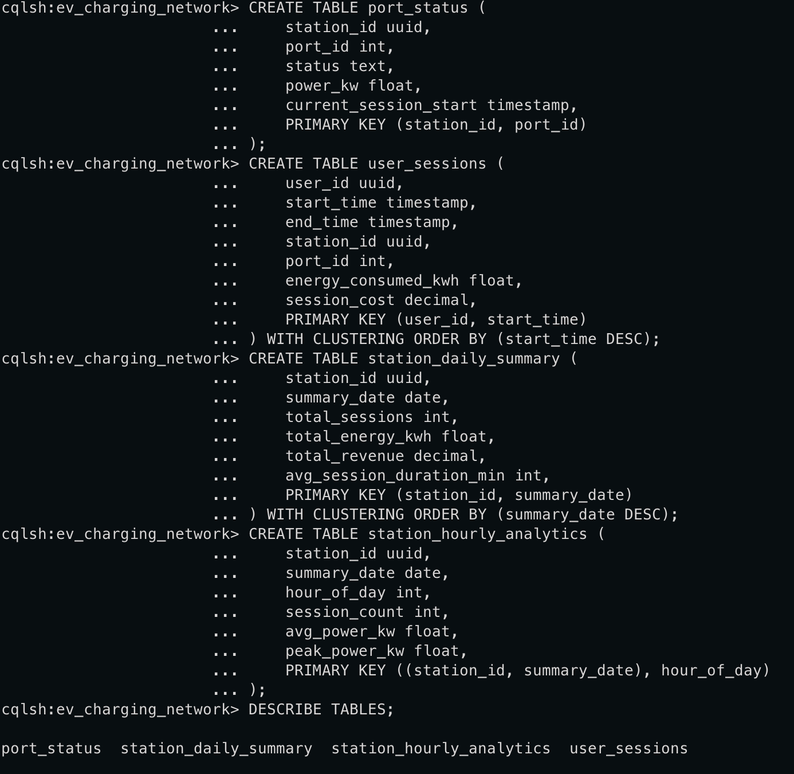
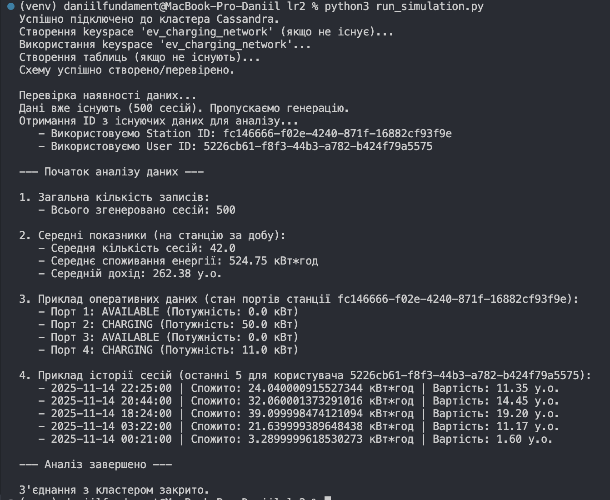

# Лабораторна робота № 2

Основи Cassandra: створення першої енергетичної системи моніторингу

# Тема:

Основи роботи з Apache Cassandra

# Мета:

Освоїти принципи проєктування розподілених схем даних у Apache Cassandra
на прикладі енергетичних систем моніторингу. Навчитися створювати
keyspace, таблиці з різними типами ключів, наповнювати їх тестовими
даними, виконувати базові запити та аналізувати ефективність різних схем
зберігання.

Keyspaces creation:

Tables creation:

Selecting data:

Script Exeution:

