# Лабораторна робота № 3

Оптимізація схем даних в Apache Cassandra для енергетичних часових рядів

# Тема:

Оптимізація схем даних в Apache Cassandra для енергетичних часових рядів

# Мета:

Спроектувати та оптимізувати схеми даних в Apache Cassandra для
зберігання часових рядів енергетичних метрик з максимальною
продуктивністю запитів.
Дані, які збиралися через Apache Kafka в першій лабораторній роботі, тепер
потрібно ефективно зберігати та обробляти в Cassandra.

Keyspace creation:
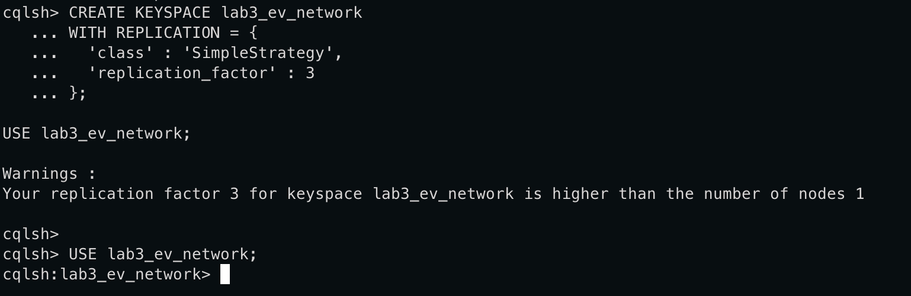

Data generating:
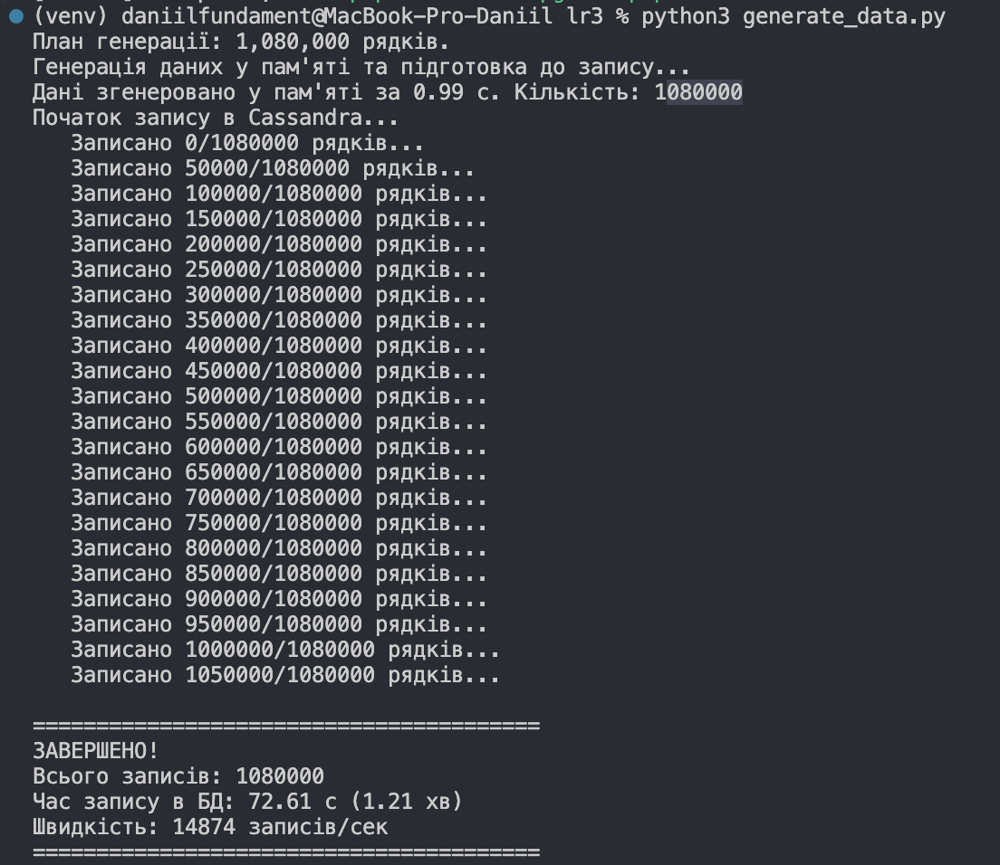
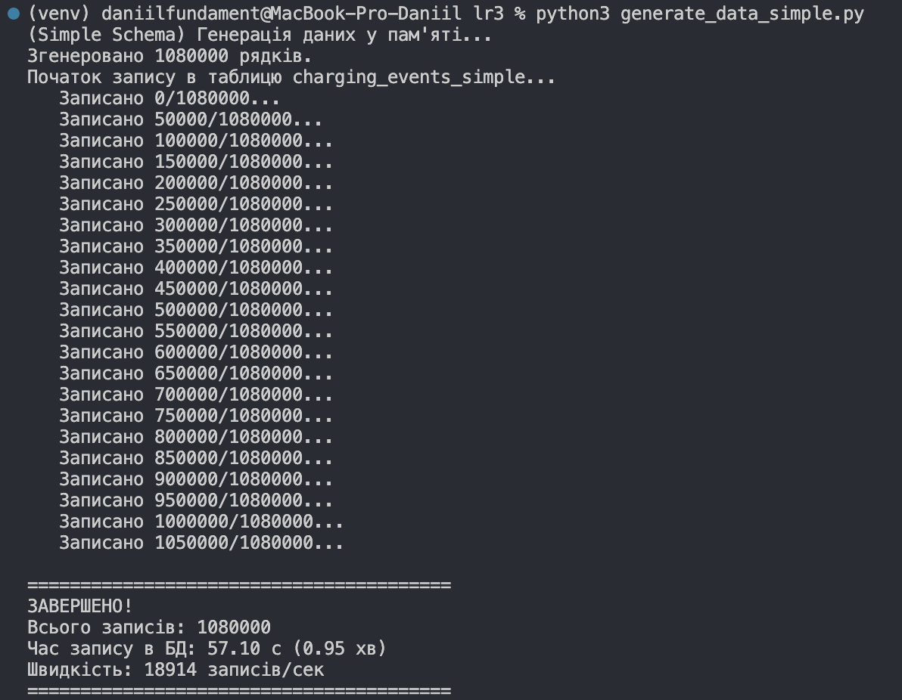
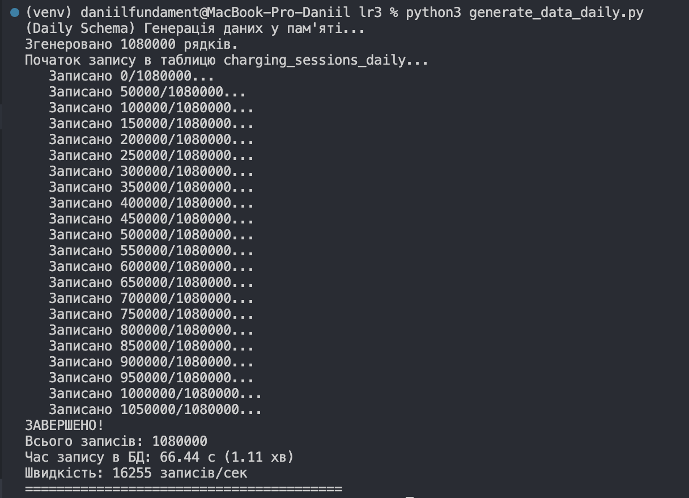

Basic benchmark:
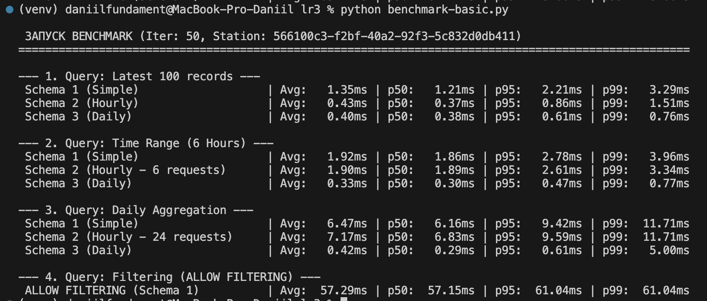

MV benchmark:
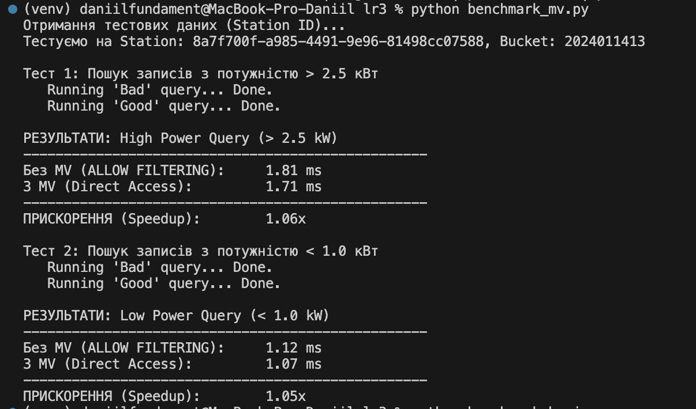

nodetables analitycs:
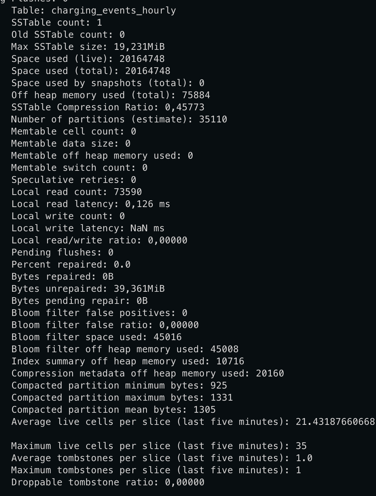
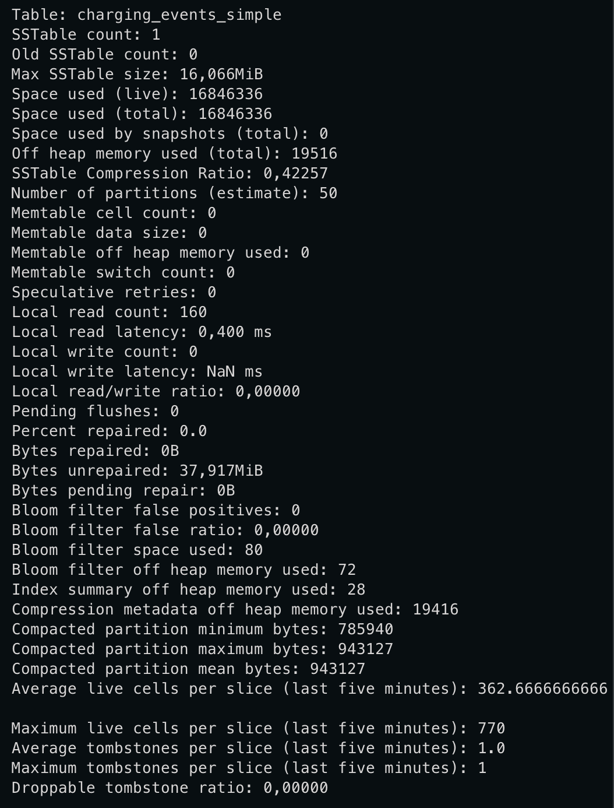
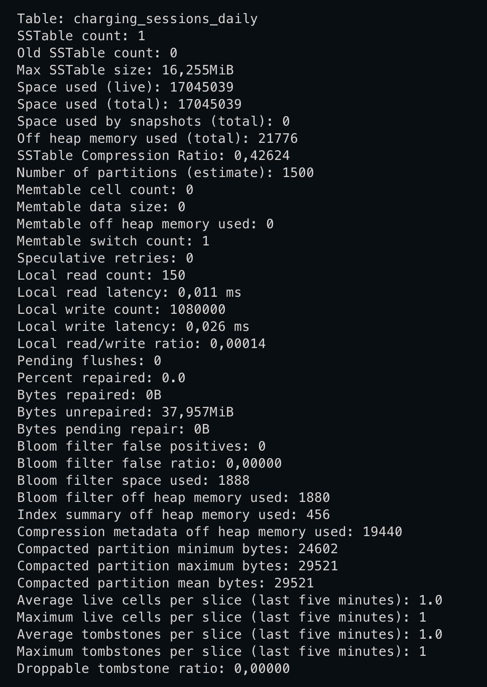
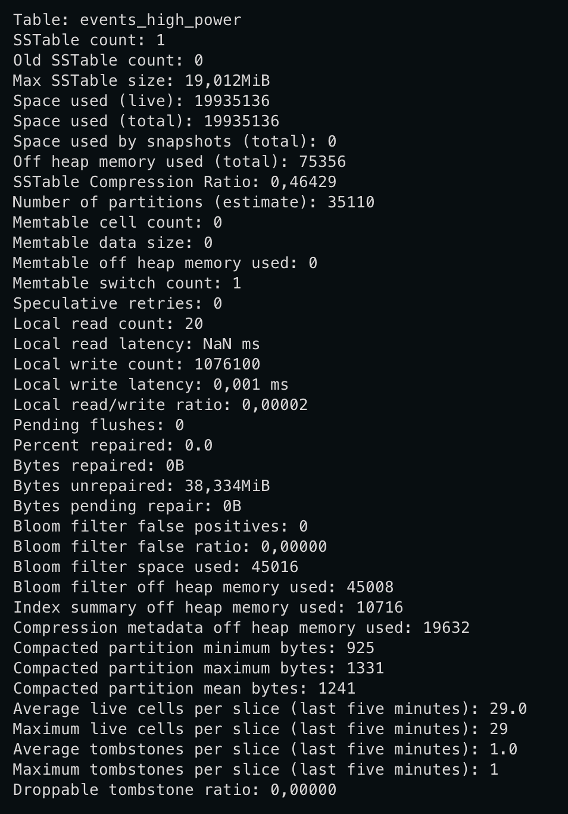
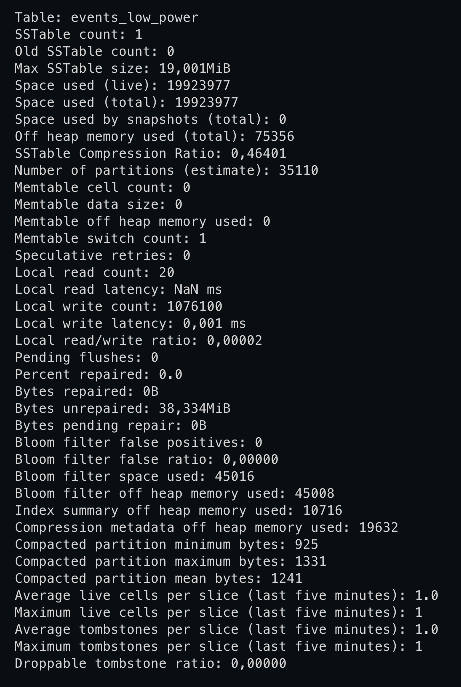
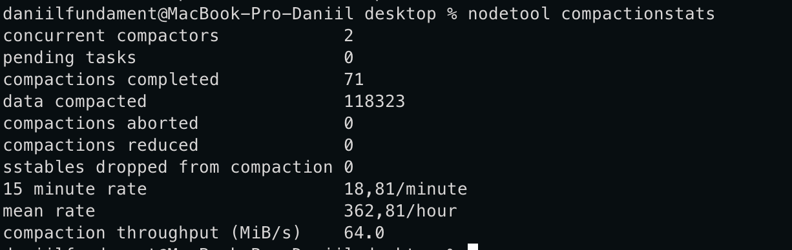
