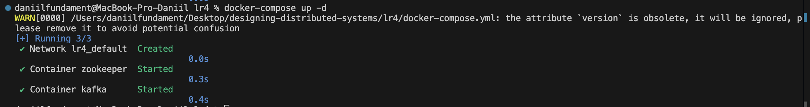
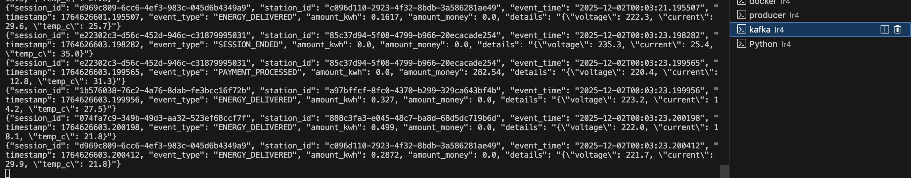
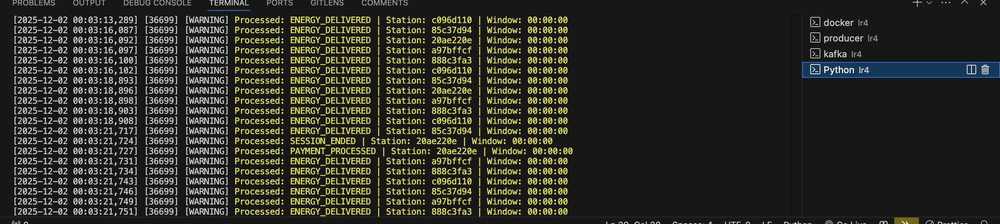
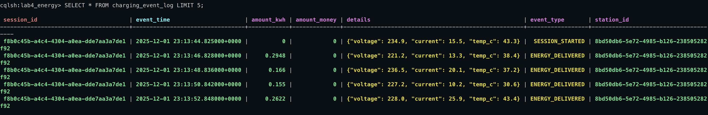
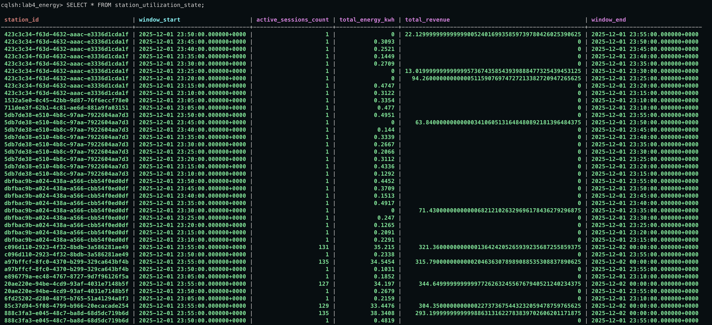
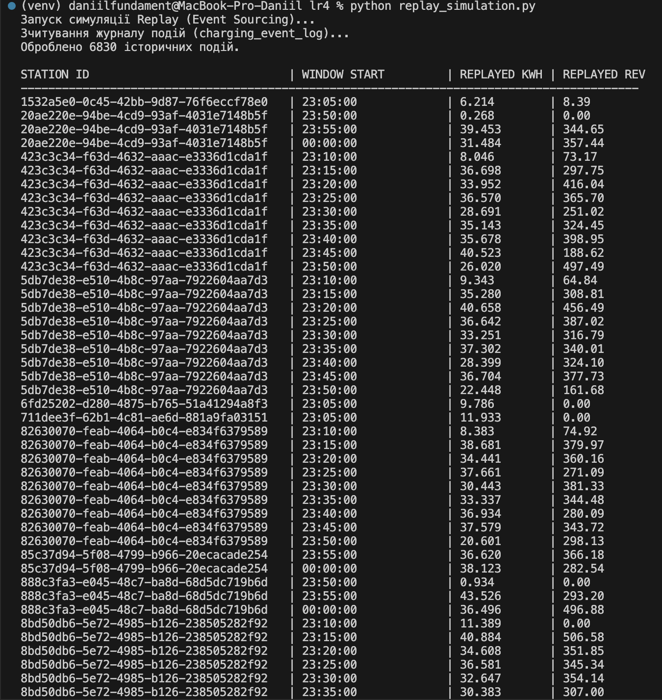

# Лабораторна робота № 4

Потокова обробка енергетичних даних з транзакційною семантикою в Apache Kafka Streams

# Тема:

Потокова обробка енергетичних даних з транзакційною семантикою в Apache Kafka Streams

# Мета:

Розробити систему потокової обробки енергетичних даних з використанням
Apache Kafka Streams, що забезпечує транзакційну семантику exactly-once та
інтеграцію з Apache Cassandra для збереження результатів обробки.

Docker containers:

Producer:

Kafka:

Stream proccessor:

Cassandra tables:

Event sourcing:

